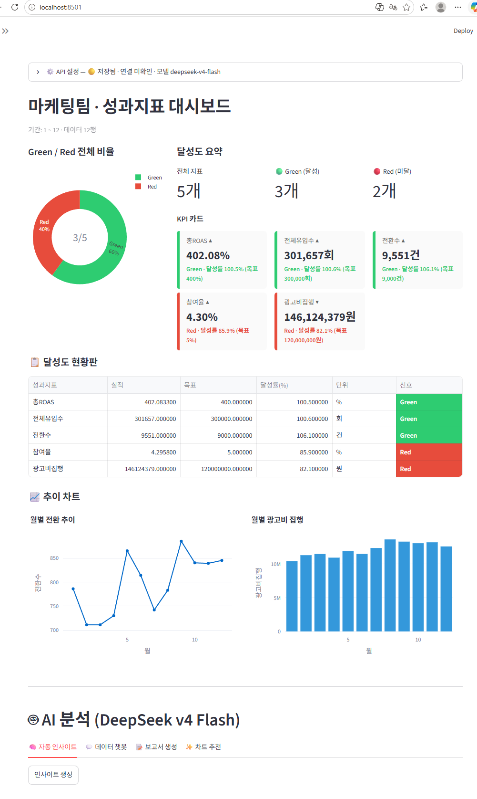
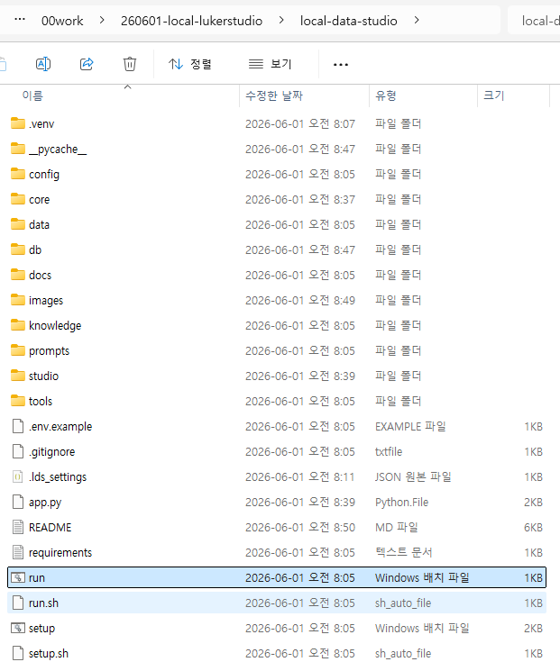
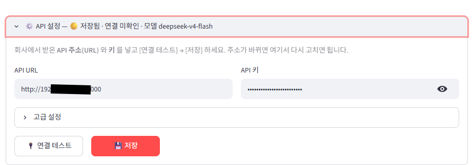
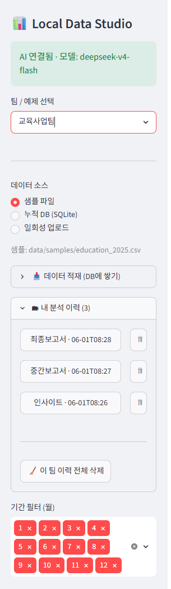
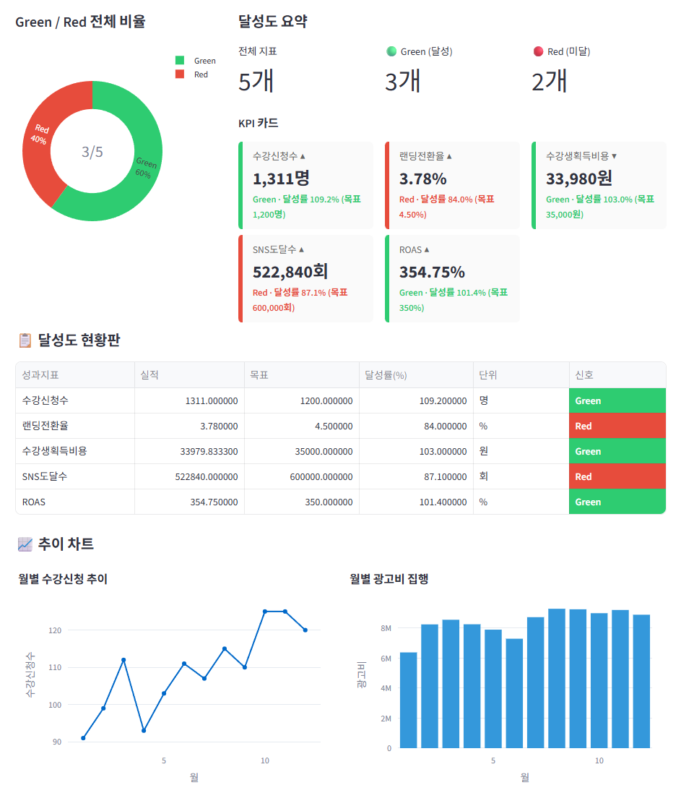
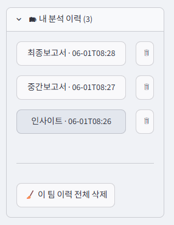
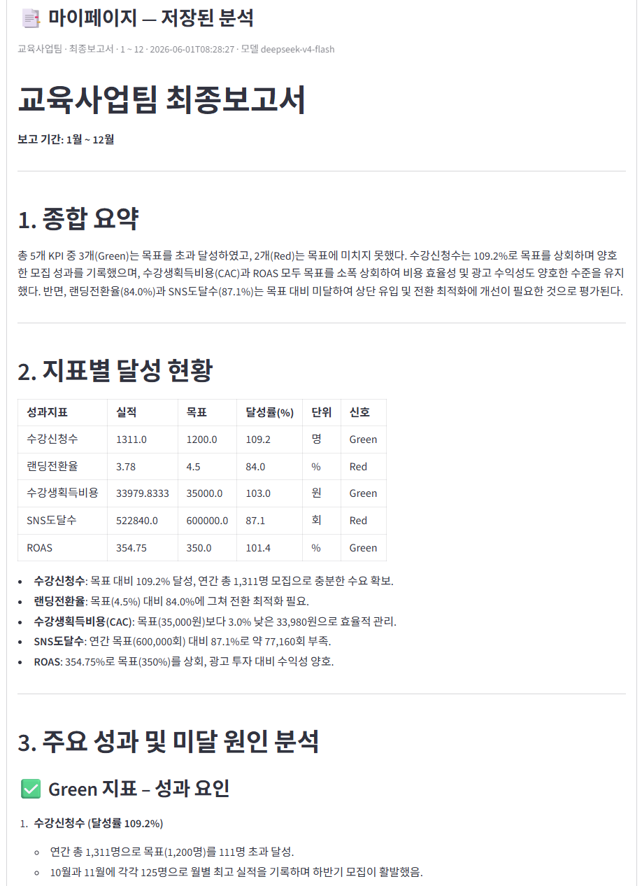
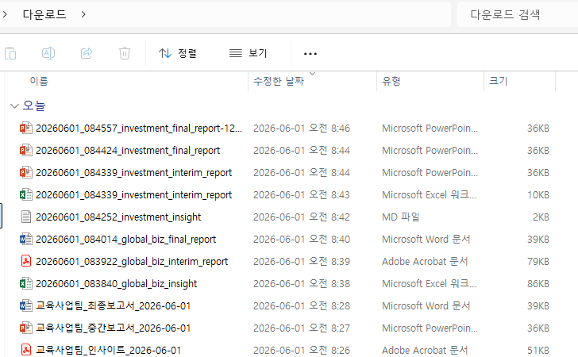

# Local Data Studio 📊 — 사용설명서

구글 Data Studio(구 Looker Studio)를 **사내 로컬로 대체**하는 팀별 성과 대시보드 스튜디오.
데이터(CSV/Excel)를 올리면 → **실시간 Green/Red 달성도 대시보드** + **중간/최종 보고서** + **AI 인사이트/챗봇/차트추천**을 즉시 만들고, 결과를 **파일로 내려받거나 DB에 자동 보관**합니다.

- **AI 엔진**: 딥시크 v4 플래시 (`deepseek-v4-flash`) — 사내 LiteLLM 프록시(OpenAI 호환) 경유
- **포함 예제 5종**: 운영팀 · 교육사업팀 · 글로벌사업팀 · 마케팅팀 · 투자팀
- **config 기반**: 팀별 YAML 1개만 바꾸면 어느 팀/도메인이든 재사용
- **모든 결과는 팀별로 분리** 보관 — 팀을 바꿔도 다른 팀 분석이 섞이지 않습니다

---

## 1. 설치 (Windows · 명령어 필요 없음)

1. 탐색기에서 **`setup.bat` 더블클릭** → 설치(처음 한 번, 수 분 소요).
2. **`run.bat` 더블클릭** → 브라우저에 대시보드가 열립니다.
3. 창은 닫지 마세요(종료는 그 창에서 `Ctrl+C`).

> macOS/Linux는 `./setup.sh` → `./run.sh`. Python 3.10+ 필요(설치 시 "Add python.exe to PATH" 체크).
> AI 키가 없어도 대시보드/표/차트는 동작합니다(AI 기능만 비활성).

---

## 2. API 설정 (회사가 준 주소/키 입력)

화면 위 **⚙️ API 설정** 패널을 펼쳐 회사가 준 **주소(URL)와 키**를 넣고 → **연결 테스트** → **저장**. 끝!

- 주소가 바뀌면 이 패널에서 다시 고치면 됩니다 (파일 편집 불필요).
- 사이드바에 **"AI 연결됨 · 모델: deepseek-v4-flash"** 가 뜨면 정상입니다.

---

## 3. 화면 둘러보기

### 3-1. 좌측 사이드바
앱은 화면을 넓게 쓰도록 **사이드바가 접힌 채로 시작**합니다. 왼쪽 위 **`»` 화살표**를 누르면 펼쳐집니다.

- **팀 / 예제 선택** — 팀을 고르면 샘플 데이터가 자동 로드
- **데이터 소스** — `샘플 파일` / `누적 DB(SQLite)` / `일회성 업로드`
- **📥 데이터 적재 (DB에 쌓기)** — 엑셀/CSV를 DB에 누적(append/upsert/replace)
- **🗂 내 분석 이력** — 이 팀의 AI 분석 기록(자세히는 5장)

### 3-2. 메인 대시보드
- **Green/Red 도넛** · **달성도 요약** · **KPI 카드** · **달성도 현황판(표)** · **추이 차트**
- 사이드바 **기간 필터(월)** 로 일부 기간만 보면 표·KPI가 함께 바뀝니다.

---

## 4. AI 분석 + 결과 내려받기

메인 하단 **🤖 AI 분석** 영역의 4개 탭:

| 탭 | 하는 일 |
|----|---------|
| 🧠 자동 인사이트 | 달성/미달 원인·시사점 요약 |
| 💬 데이터 챗봇 | "목표를 미달한 지표는?" 같은 자연어 질문 |
| 📝 보고서 생성 | **중간/최종 보고서** 작성 |
| ✨ 차트 추천 | 업로드 데이터에 맞는 차트/KPI 구성을 YAML로 제안 |

### 4-1. 자동 인사이트
**인사이트 생성** 버튼을 누르면 분석이 나오고, 바로 아래에
**⬇️ Markdown · Excel · Word · PDF · PPT** 다운로드 버튼과 **저장 ID** 가 표시됩니다.

<!-- 스크린샷 추가 예정 → 캡처 후 아래 한 줄로 교체:
 -->
_📷 스크린샷 추가 예정 (자동 인사이트 결과 + 다운로드 버튼 + 저장 ID)_

### 4-2. 보고서 생성
**중간보고서 / 최종보고서** 를 고르고 **보고서 생성** → 같은 5가지 포맷으로 내려받기.

<!-- 스크린샷 추가 예정 → 캡처 후 아래 한 줄로 교체:
 -->
_📷 스크린샷 추가 예정 (보고서 생성 결과 + 다운로드 버튼)_

---

## 5. 내 분석 이력 & 마이페이지 (자동 저장)

AI로 만든 인사이트·보고서·챗봇 답변은 **자동으로 SQLite(`db/lds.sqlite`)에 보관**됩니다.

- **고유 저장 ID**: `일시분초_영어팀키_종류` 형식이라 **부서 간에도 절대 겹치지 않습니다**.
  - 예) `20260601_084252_investment_insight`, `20260601_084424_investment_final_report`, `20260601_083840_global_biz_insight`
  - 종류 표기: `insight` / `interim_report` / `final_report` / `chat`
  - 이 ID가 **다운로드 파일명**으로도 그대로 쓰입니다.

### 5-1. 사이드바 「🗂 내 분석 이력」
- 이 팀의 기록만 최신순으로 표시(다른 팀 것은 안 보임).
- 항목을 누르면 본문에 **마이페이지**로 펼쳐집니다.
- 각 항목의 **🗑** 로 한 건 삭제, 맨 아래 **🧹 이 팀 이력 전체 삭제**.

### 5-2. 마이페이지
선택한 분석을 본문 상단에 펼쳐 보여주고, 거기서 **다시 다운로드** 하거나 **✖ 닫기** 할 수 있습니다.
팀을 바꾸면 마이페이지는 자동으로 닫힙니다.

---

## 6. 결과물 내려받기

다운로드 버튼으로 받은 파일은 **저장 ID 그대로** 파일명이 붙어, 부서·종류·시각이 한눈에 구분됩니다.

---

## 새 팀 추가하기

`config/teams/<우리팀>.yaml` 하나 만들고 데이터만 넣으면 끝. (또는 **✨ 차트 추천**이 YAML을 만들어 줌)
→ 자세한 방법: [docs/CONFIG_GUIDE.md](docs/CONFIG_GUIDE.md)

## 더 알아보기 (docs / knowledge)

| 문서 | 내용 |
|------|------|
| [docs/SETUP.md](docs/SETUP.md) | 설치 · 환경변수 · 실행 상세 |
| [docs/CONFIG_GUIDE.md](docs/CONFIG_GUIDE.md) | 새 팀/KPI/목표 추가법 |
| [docs/DATA_SCHEMA.md](docs/DATA_SCHEMA.md) | 데이터 파일 컬럼 규약 |
| [docs/DATA_STORE.md](docs/DATA_STORE.md) | **데이터 누적 전략 (SQLite 리포트)** |
| [docs/LLM_GUIDE.md](docs/LLM_GUIDE.md) | DeepSeek/LiteLLM 연결 · 모델 · 비용 · skill 고도화 |
| [docs/ARCHITECTURE.md](docs/ARCHITECTURE.md) | 코드 구조와 데이터 흐름 |
| [knowledge/](knowledge/) | KPI 정의 · 차트 선택 규칙 · 대시보드 설계 원칙 · 팀 맥락 |
